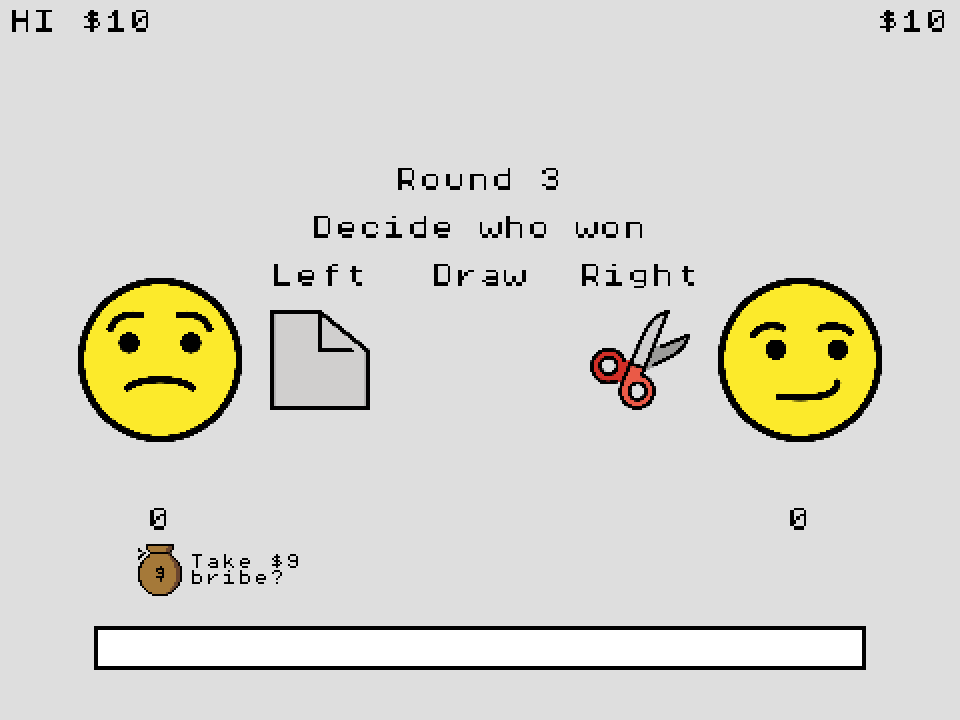

# RPS Referee Simulator
RPS Referee Simulator is a sports refereeing game written in JavaScript with [Kaboom.js](https://kaboomjs.com/) made for both the [GMTK Game Jam 2023](https://itch.io/jam/gmtk-2023) and [OGAM25](https://itch.io/jam/one-game-a-month-25). The game is available to play, for free, in your browser at: https://swilliamsio.itch.io/rps-referee-simulator

All programming was done by [s-williams](https://github.com/s-williams).
